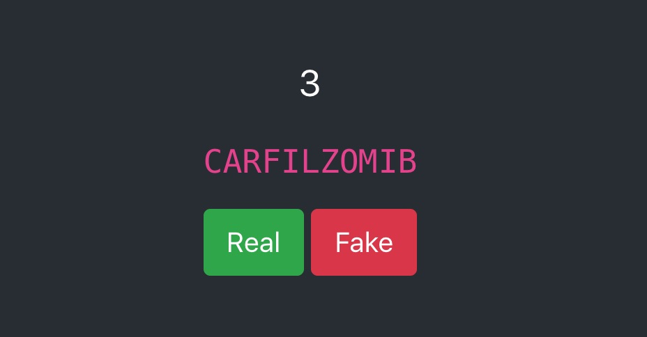

# Rx 💉

A character-level language model trained on the [British National Formulary (BNF)](https://bnf.nice.org.uk/) A-Z of clinical medicines and a minigame to challenge it.

[Play the game](https://rx.coxy1989.com)

What's in the box?

- Keras/Tensorflow [pipeline](https://nbviewer.jupyter.org/github/coxy1989/rx/blob/master/rx_model/rx.ipynb) for a character-level language model.
- [Inference in the browser](https://github.com/coxy1989/rx/blob/master/rx_spa/src/model.js) with Tensorflow.js.
- Quick n' Dirty [minigame](https://rx.coxy1989.com), built in react.

*The training code in this repo was executed on an Ubuntu 18.04 paperspace instance with a Nvidia Quadro P4000 GPU, NVIDIA Driver: 410.48, CUDA 10.0.130-1.*

## Developer Quickstart

### Train the model

1. `git clone git@github.com:coxy1989/rx`

2. `cd rx/rx_model` 

3. `conda env create -f environment.yml`

3. `source activate rx`

4. `jupyter notebook`

5. [Import the keras model to tensorflow.js](https://js.tensorflow.org/tutorials/import-keras.html)

### Run the frontend

1. `git clone git@github.com:coxy1989/rx`

2. `cd rx/rx_spa` 

3. `docker build -t rx .`

4. `docker run -it -v $PWD:/app -p 3000:3000 --entrypoint bash rx`

5. `cd app`

6. `npm start`

